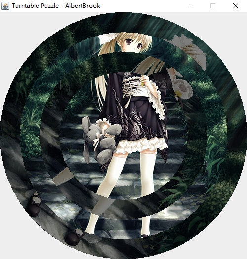

# 转盘拼图
根据刺客信条2的真相20里的解密游戏，基于java实现的转盘拼图
## 运行
```
javac Main.java
java Main
```

## 操作
W - 向外圈移动<br>
S - 向内圈移动<br>
A - 逆时针旋转<br>
D - 顺时针旋转<br>
R - 打乱
## 说明
这是根据刺客信条2的真相20里的解密游戏做的，挺有意思的<br>
从外到内依次编号为0 ~ 5<br>
5作为定位保持不动<br>
选择0动时2跟着动<br>
选择2动时4跟着动<br>
选择4动时0跟着动<br>
1和3独立动<br>
<br>
有意思的地方在于0、2、4是关联的<br>
在0需要顺时针2次，其它圈对齐的情况下<br>
0顺时针1次，2跟着顺时针1次<br>
2逆时针1次，4跟着逆时针1次<br>
此时2没有变化，使得0和4对齐<br>
4顺时针1次，0跟着顺时针1次就把0、2、4对齐了<br>
<br>
根据这个技巧可以发现：<br>
假设0和2需要n次对齐<br>
2和4需要m次对齐<br>
只要abs(n) = abs(m)<br>
或者abs(n - m) % 2 == 0就可以保证是可以对齐的